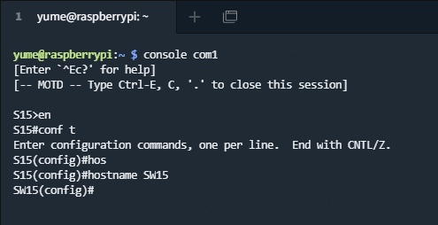
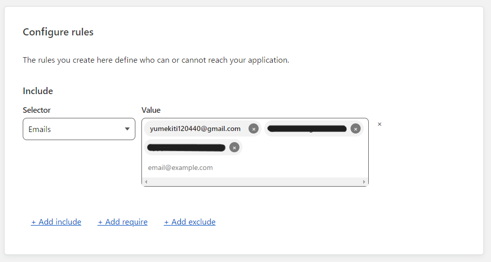

# 自動化について
## アジェンダ

- 背景・目的
- 内容
- 検証
- 最後に

# 背景・目的
## 背景
複数の構築が複雑化や人為的ミスにより、構築に時間がかかる。
また、構築の手順が複雑化すると、管理が難しくなる。
## 目的
 **自動で構築する**

# 内容
## やりたいこと
- コンソールサーバーを用いて、ネットワーク機器に接続し、IPアドレスの設定を行う。
- 複数の機器に設定を一括で行う。


# 検証
## やったこと
- コンソールサーバーを用いて、ネットワーク機器に接続
- 外部からのコンソールサーバーへの接続を許可
- Ansibleでネットワーク設定の自動化
## コンソールサーバーの構築

 Raspberry Pi を用いて、コンソールサーバーの構築


## 外部からの接続

 CloudFlare Access を用いてトンネリング


## 構築の自動化

 ymlファイルに設定を記述し、Ansibleを用いてネットワーク構築を自動化
## main.yml

```yml
- hosts: cisco
  gather_facts: no
  connection: local
  tasks:
    - name: send show version
      ios_config:
        commands: hostname R1
```
## hosts

```bash
[cisco:vars]
ansible_python_interpreter=/usr/bin/python3
ansible_ssh_user=admin
cisco_enable_secret=cisco

ansible_connection=network_cli
ansible_network_os=ios

[cisco]
10.16.10.77
```

# 最後に
## 今後

- Terraformでもできるっぽい？
- 規模の拡大
## まとめ

構築の自動化により、構築の手順が複雑化すると、管理が難しくなる問題を解決できる。

- やったこと
  - コンソールサーバーの構築
  - 外部からの接続
  - 設定の自動化

