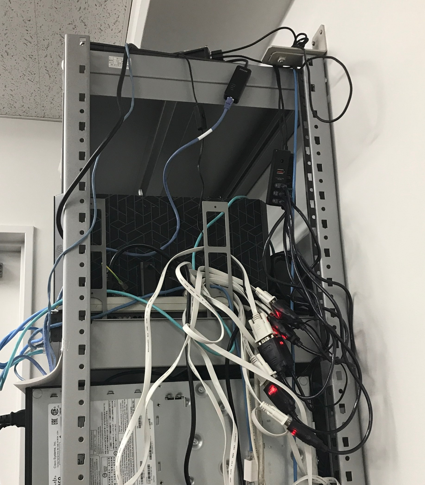
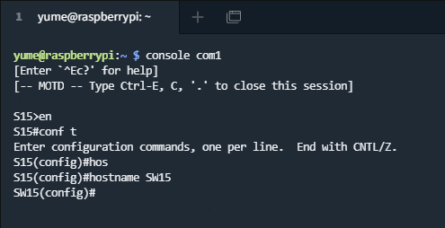
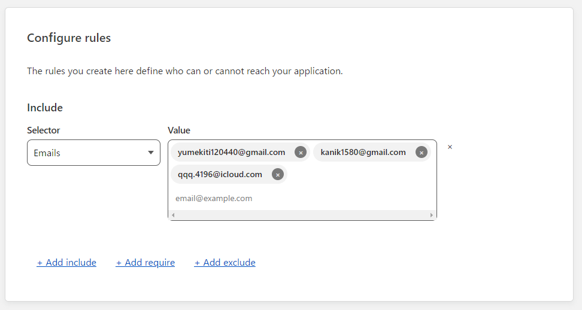

<!--
_class: headline
-->

# 自動化について

---

<!--
_class: general
_header: "はじめに"
-->

## アジェンダ

- 背景・目的
- 内容
- 検証
- まとめ

---

<!--
_class: headline
-->

# 背景・目的

---

<!--
_class: general
_header: "背景・目的"
-->

## 背景
複数の構築が複雑化や人為的ミスにより、構築に時間がかかる。
また、構築の手順が複雑化すると、管理が難しくなる。

---

<!--
_class: general
_header: "背景・目的"
-->

## 目的
### **ネットワークを自動で構築する**

---

<!--
_class: headline
-->

# 内容

---

<!--
_class: general
_header: "内容"
-->

## やりたいこと
- コンソールサーバーを用いて、ネットワーク機器に接続し、IPアドレスの設定を行う。
- 複数の機器に設定を一括で行う。

---

<!--
_class: headline
-->

# 検証

---

<!--
_class: general
_header: "検証"
-->

## やったこと
- コンソールサーバーを用いて、ネットワーク機器に接続
- 外部からのコンソールサーバーへの接続を許可
- Ansibleでネットワーク設定の自動化

---

<!--
_class: general
_header: "コンソールサーバー"
-->

## コンソールサーバー

### Raspberry Pi 3 を用いて、<br>コンソールサーバーの構築

---

<!--
_class: general
_header: "コンソールサーバー"
-->



---

<!--
_class: general
_header: "コンソールサーバー"
-->



---

<!--
_class: general
_header: "外部からの接続"
-->

## 外部からの接続

### CloudFlareを用いてトンネリング

---

<!--
_class: general
_header: "外部からの接続"
-->


---

<!--
_class: general
_header: "外部からの接続"
-->



---

<!--
_class: general
_header: "設定の自動化"
-->

## 構築の自動化

### ymlファイルに設定を記述し、<br>Ansibleを用いてネットワーク構築を自動化

---

<!--
_class: general
_header: "設定の自動化"
-->

## main.yml

```yml
- hosts: cisco
  gather_facts: no
  connection: local
  tasks:
    - name: send show version
      ios_config:
        commands: hostname R1
```

---

<!--
_class: general
_header: "設定の自動化"
-->

## hosts

```bash
[cisco:vars]
ansible_python_interpreter=/usr/bin/python3
ansible_ssh_user=admin
cisco_enable_secret=cisco

ansible_connection=network_cli
ansible_network_os=ios

[cisco]
10.16.10.77
```

---

<!--
_class: headline
-->

# まとめ

---

<!--
_class: general
_header: "まとめ"
-->

## 今後

- Terraformでもできるっぽい？
- 規模の拡大

---

<!--
_class: general
_header: "まとめ"
-->

## まとめ

構築の自動化により、構築の手順が複雑化すると、管理が難しくなる問題を解決できる。