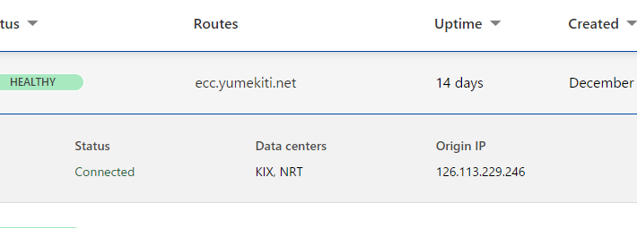

<!--
_class: headline
-->

# 自動化について

---

<!--
_class: general
_header: "はじめに"
-->

## アジェンダ

- 背景・目的
- 内容
- 検証
- まとめ

---

<!--
_class: headline
-->

# 背景・目的

---

<!--
_class: general
_header: "背景・目的"
-->

## 背景
複数の構築が複雑化や人為的ミスにより、構築に時間がかかる。
また、構築の手順が複雑化すると、管理が難しくなる。

---

<!--
_class: general
_header: "背景・目的"
-->

## 目的
### **ネットワークを自動で構築する**

---

<!--
_class: headline
-->

# 内容

---

<!--
_class: general
_header: "内容"
-->

## やりたいこと
- コンソールサーバーを用いて、ネットワーク機器に接続し、IPアドレスの設定を行う。
- ネットワーク構築を自動化する。
- 物理ネットワーク機器に対して、設定を一括で行う。

---

<!--
_class: headline
-->

# 検証

---

<!--
_class: general
_header: "検証"
-->

## やったこと
- コンソールサーバーを用いて、ネットワーク機器に接続
- 外部からのコンソールサーバーへの接続を許可
- Ansibleでネットワーク構築の自動化
- 物理ネットワーク機器に対して、一括で設定

---

<!--
_class: general
_header: "コンソールサーバー"
-->

## コンソールサーバー

- Raspberry Pi 3 を用いて、コンソールサーバーの構築

---

<!--
_class: general
_header: "コンソールサーバー"
-->

---

<!--
_class: general
_header: "外部からの接続"
-->

- CloudFlareを用いてトンネリング

---

<!--
_class: general
_header: "外部からの接続"
-->

---

<!--
_class: general
_header: "外部からの接続"
-->

---

<!--
_class: general
_header: "まとめ"
-->

## まとめ
ネットワーク構築を自動化することで、それぞれのネットワーク機器の設定を一括で行うことができる。

