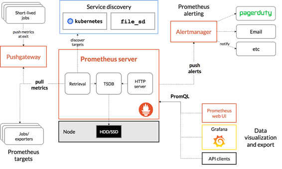

<!--
_class: headline
-->

# Prometheusについて

---

<!--
_class: general
_header: "はじめに"
-->

## はじめに

このスライドでは、IT系学生向けに**Prometheus**について説明します。Prometheusは、**オープンソースのシステム監視ツール**であり、クラウドネイティブなアプリケーションの監視に最適です。Prometheusは、多くのプログラミング言語に対応しており、カスタマイズ性が高いため、柔軟性のある監視システムを構築することができます。

---
<!--
_class: general
_header: "はじめに"
-->

## 目次

Prometheusとは？
Prometheusの特徴
Prometheusのアーキテクチャ
Prometheusのメトリクスの収集
Prometheusのクエリ言語

---
<!--
_class: headline
-->

## 内容

---
<!--
_class: general
_header: "内容"
-->

<!--
Prometheusは、オープンソースのシステム監視ツールであり、クラウドネイティブなアプリケーションの監視に最適なツールです。多くのプログラミング言語に対応しており、カスタマイズ性が高いため、柔軟性のある監視システムを構築することができます。
-->

## Prometheusとは？

- オープンソースのシステム監視ツール
- クラウドネイティブなアプリケーションの監視に最適
- 多くのプログラミング言語に対応
- カスタマイズ性が高い

---
<!--
_class: general
_header: "内容"
-->

<!--
Prometheusは、Pull型のメトリクス収集を行い、高い可用性とスケーラビリティを持ちます。カスタマイズ性が高く、データの保存とクエリが可能であり、ダッシュボードの作成が容易です。
-->

## Prometheusの特徴

- Pull型のメトリクス収集
- 高い可用性とスケーラビリティ
- カスタマイズ性が高い
- データの保存とクエリが可能
- ダッシュボードの作成が容易

---
<!--
_class: general
_header: "内容"
-->

<!--
Prometheusは、Prometheus Server、Exporters、Pushgateway、Alertmanagerの4つのコンポーネントから構成されています。Prometheus Serverは、メトリクスの収集、保存、クエリを行い、Exportersは、監視するアプリケーションやサービスのメトリクスをエクスポートします。Pushgatewayは、Push型のメトリクス収集を行い、Alertmanagerは、アラートの送信と管理を担当します。
-->

## Prometheusのアーキテクチャ

- Prometheus Server: メトリクスの収集、保存、クエリ
- Exporters: 監視するアプリケーションやサービスのメトリクスをエクスポート
- Pushgateway: Push型のメトリクス収集
- Alertmanager: アラートの送信と管理

---

---
<!--
_class: general
_header: "内容"
-->

<!--
Prometheusは、Exportersを使用して、アプリケーションやサービスのメトリクスをエクスポートし、Prometheus Serverが、定期的にExportersからメトリクスを収集します。これにより、Pull型のメトリクス収集が実現されます。
-->

## Prometheusのメトリクスの収集

1. Exportersを使用して、アプリケーションやサービスのメトリクスをエクスポート
1. Prometheus Serverが、定期的にExportersからメトリクスを収集
1. Pull型のメトリクス収集

---
<!--
_class: general
_header: "内容"
-->

<!--
Prometheusのクエリ言語であるPromQLを使用することで、メトリクスの加工や計算が可能です。また、データの可視化が容易になります。
-->

## Prometheusのクエリ言語

- PromQL: Prometheusのクエリ言語
- メトリクスの加工や計算が可能
- データの可視化が容易

---
<!--
_class: headline
-->

## 最後に

---
<!--
_class: general
_header: "最後に"
-->

<!--
まとめとして、Prometheusは、オープンソースのシステム監視ツールであり、クラウドネイティブなアプリケーションの監視に最適です。Pull型のメトリクス収集を行い、高い可用性とスケーラビリティを持ちます。また、PromQLを使用することで、柔軟なデータ加工や計算が可能であり、データの可視化が容易になります。
-->

## まとめ

Prometheusは、柔軟性のある**監視システムを構築**することができるため、現在広く使用されています。また、Prometheusの特徴であるPull型のメトリクス収集や、クエリ言語であるPromQLを使用することで、高い可用性とスケーラビリティを持った監視システムを構築することができます。是非、今後のシステム監視に活用してみてください。
