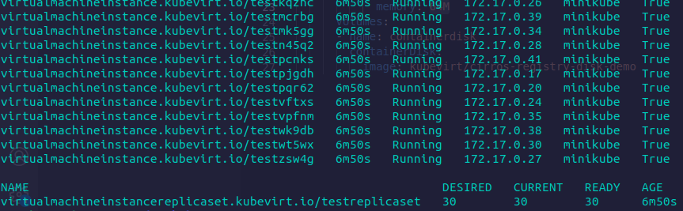

# KubernetesでのIaaS環境について

ネットワークゼミ

## アジェンダ

- 背景
- 目的
- 内容
- 検証
- まとめ

# 背景
## 背景

- 自宅サーバーをIaaS環境にしたい！
- ICTSCの問題サーバー構築してみたい
- AWSなどIaaSの需要が高まっている。

## 目的
## 目的

 IaaS構築・運用

# 内容
## 何故 IaaS

- 自由度が高い
  - CPUやメモリー、ハードディスクなどを**必要な分だけ**使うことができる
- 特殊要件をクリアできる
## 何故 k8s

- スケーリングやオートヒーリングなど<br>**機能が充実**している
- コンテナも扱える
## 情報収集

 次世代IaaSとの言葉が。。
 ↓
 KubeVirtについて学ぶ
## KubeVirtとは

KubernetesでIaaSを実現するには、
VMを操作するための追加の仕組みが必要になります。
Kubernetesのコントロールプレーン（制御の仕組み）を活用し、
VMを作成・管理する仕組みを提供するのがKubeVirtです。
## 従来仮想基盤との違い

**VMとコンテナの連携が容易**

Kubernetes上のコンテナとVMの連携が容易であることも挙げられます。
通常のVMだと当然ながらKubernetesの外にいます。
従って、コンテナと通信するにはコンテナを外部に公開する設定が必要でした。
更にはKubernetes内で定義した名前をVMで扱うことができませんでした。Kubernetes内にVMを構築できることで、これらの考慮が不要になり、
コンテナとの連携が比較的容易になります。

# 検証
## VMを⼤量に起動する

<br><br>

```yaml
spec:
  replicas: 2
  selector:
    matchLabels:
      myvmi: myvmi
  template:
    metadata:
      name: test
      labels:
        myvmi: myvmi
    spec:
      domain:
        devices:
          disks:
          - disk:
            name: containerdisk
        resources:
          requests:
            memory: 64M
      volumes:
      - name: containerdisk
        containerDisk:
          image: kubevirt/cirros-registry-disk-demo
```

```yaml
spec:
  replicas: 2
```

```yaml
containerDisk:
  image: kubevirt/cirros-registry-disk-demo
```


## k8sの機能は動くのか

k8sにはオートヒーリング機能と言うPodが停止すると
自動的に再起動してくれる機能がある、
その機能がKubeVirtにも機能するかを検証する

```bash
$ kubectl get all
NAME                                READY   STATUS    RESTARTS   AGE
pod/virt-launcher-test8z8fj-gg4gw   2/2     Running   0          2m3s
pod/virt-launcher-testxn22t-mpj7x   2/2     Running   0          48s

NAME                 TYPE        CLUSTER-IP   EXTERNAL-IP   PORT(S)   AGE
service/kubernetes   ClusterIP   10.96.0.1    <none>        443/TCP   10m

NAME                                           AGE    PHASE     IP            NODENAME   READY
virtualmachineinstance.kubevirt.io/test8z8fj   2m3s   Running   172.17.0.13   minikube   True
virtualmachineinstance.kubevirt.io/testxn22t   48s    Running   172.17.0.14   minikube   True

NAME                                                          DESIRED   CURRENT   READY   AGE
virtualmachineinstancereplicaset.kubevirt.io/testreplicaset   2         2         2       2m3s
```

# まとめ
## メリット

- アプリケーションがカーネルを共有しない
- VMの起動、停止、
ライブマイグレーションが可能
## デメリット

- 資源効率が悪い。
  - KubeVirtはOSのイメージを利用するため、容量を多く使います。更にVMの数が増えるほど、VM間におけるOSモジュールの重複や不要なOSモジュールが増えてしまいます。このような観点でコンテナと比較すると資源効率は悪い
## まとめ

個人的に大量にVMを立てる時には使いやすいと感じた。
あと、コンテナと連携がとても容易で良き。

バージョンも現在は v0.55.0 とまだ v1 を越していないのでできることが限られているが、これからの進化に期待が膨らんだ。