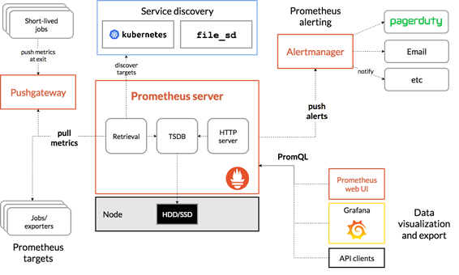

<!--
_class: headline
-->

# Prometheusについて


---

<!--
_class: general
_header: "はじめに"
-->

## アジェンダ

- 背景・目的
- 内容
- 検証
- まとめ

---

<!--
_class: headline
-->

# 背景・目的

---

<!--
_class: general
_header: "背景・目的"
-->

## 背景

- モニタリングツールを調査
- 検証

---

<!--
_class: general
_header: "背景・目的"
-->

## 目的

### 活用方法の確認

---

<!--
_class: headline
-->

# 内容

---

<!--
_class: general
_header: "内容"
-->

## Prometheusとは

オープンソースの**モニタリングプラットフォーム**です。
リアルタイムで稼働しているシステムやサービスを監視するために使用されます。
特に、Webサイトやアプリケーションのパフォーマンスを確認したり、
サーバーのリソース使用状況をモニタリングするためによく使われます。

---

<!--
_class: general
_header: "内容"
-->

## Prometheusの特徴

- サーバーのメトリクスを収集し、可視化する
- メトリクスに異常があった場合にアラートを発生させる
- メトリクスを監視し、記録する

---

<!--
_class: general
_header: "内容"
-->

# Prometheusのアーキテクチャ

---



---

<!--
_class: general
_header: "内容"
-->

## メトリクスとは

コンピューターシステムやサービスの性能や状態を表す数値のこと
例えば、CPU使用率やメモリ使用率などがメトリクスになる。

---

<!--
_class: general
_header: "内容"
-->

## メトリクスの活用

- パフォーマンスの確認
  - システムが過負荷になっていないか確認
- トラブルシューティング
  - レスポンスタイムが遅いと感じた場合、メトリクスを確認して原因を特定
- アラートの送信
  - CPU使用率が高いと感じた場合、アラートを送信

---

<!--
_class: headline
-->

# 検証

---

<!--
_class: general
_header: "検証"
-->

## 検証すること

- コンテナを使った環境の構築
- モニタリングツールでのメトリクスの確認
- 負荷テストでのメトリクスの確認

---

<!--
_class: general
_header: "検証"
-->

## コンテナを使った環境の構築

- 必要な環境
  - exporter
  - prometheus
  - grafana


---

<!--
_class: general
_header: "検証"
-->

## モニタリングツールでのメトリクスの確認

- メトリクスの確認
  - CPU使用率
  - メモリ使用率
  - ネットワーク使用率
  - ディスク使用率

---

<!--
_class: general
_header: "検証"
-->

## 負荷テストでのメトリクスの確認

stressコマンドを使って負荷をかける

```bash
$ stress --cpu 1 --io 1 --vm 1 --vm-bytes 128M --timeout 10s
```

---

<!--
_class: headline
-->

# まとめ

---

<!--
_class: general
_header: "まとめ"
-->

## まとめ

Prometheusはモニタリングツールの一つである。
メトリクスを収集し、可視化することができる。
また、メトリクスに異常があった場合にアラートを発生させることができる。
