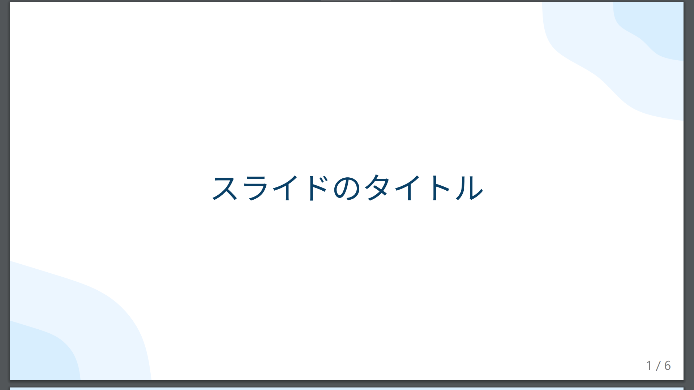
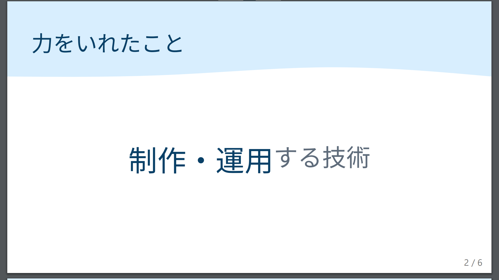

# marp-ictsc-theme

Marp yumekiti Theme is a theme for [Marp](https://marp.app/).

## 使用例

|||
|-|-|
|  |  |

## 使い方

VS Code の設定で `markdown.Marp.themes` と検索し追加ボタンで `https://raw.githubusercontent.com/yumekiti/slides/main/style.css` を追加する

