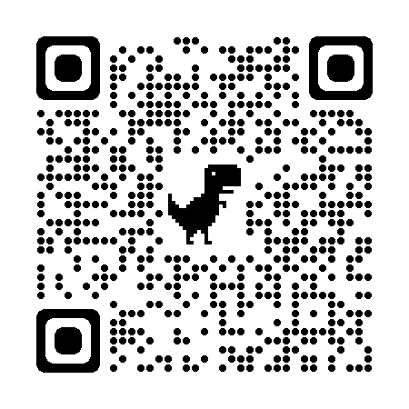

<!--
_class: headline
-->

# 自己紹介

---

<!--
_class: general
_header: "はじめに"
-->

## アジェンダ

- 自己紹介
- 今までやってきたこと
- 今後やってみたいこと
- やってて良かったこと
- まとめ

---

<!--
_class: general
_header: "自己紹介"
-->

## 自己紹介

- 名前: ゆめきち
- 趣味: Web関連の技術研究
- 出身: 大阪

---

<!--
_class: general
_header: "今までやってきたこと"
-->

## 今までやってきたこと

- 学生アプリの非公式サイトの運営
- HackUなどコンテストの参加
- プロジェクトマネジメント

---

<!--
_class: general
_header: "今までやってきたこと"
-->

---

<!--
_class: general
_header: "得意分野"
-->

## 得意分野

### Web関連

---

<!--
_class: general
_header: "与えられること"
-->

## 与えられること

- Web関連のフルスタックな知識
- 開発時に役立つツールの知識
- 設計や要件定義のアドバイス
