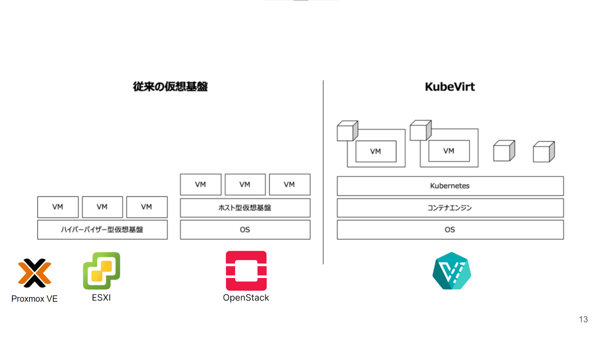
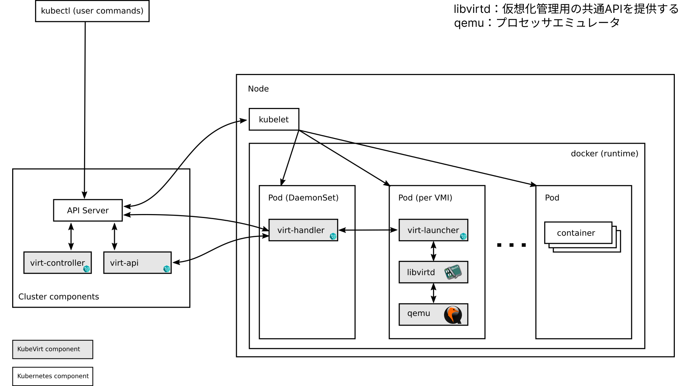
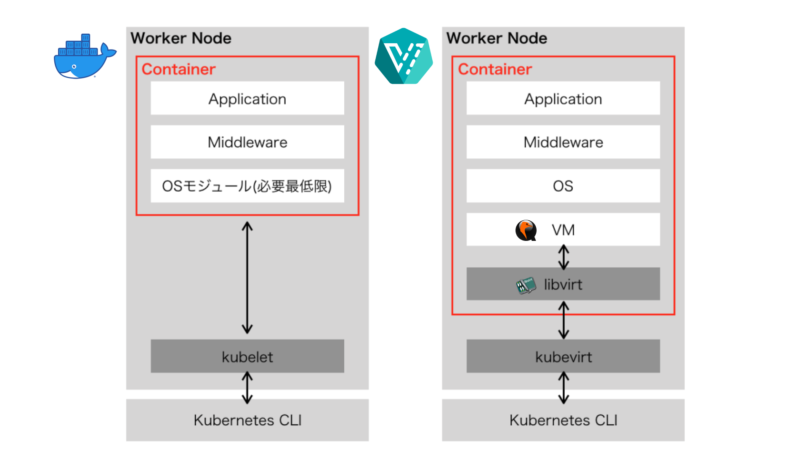

## KubeVirt とは

---

Kubernetes で IaaS を実現するには、
VM を操作するための追加の仕組みが必要になります。
Kubernetes のコントロールプレーン（制御の仕組み）を活用し、
VM を作成・管理する仕組みを提供するのが KubeVirt です。

---

## 従来仮想基盤との違い

---

---

## VM とコンテナの連携が容易

Kubernetes 上のコンテナと VM の連携が容易であることも挙げられます。
通常の VM だと当然ながら Kubernetes の外にいます。
従って、コンテナと通信するにはコンテナを外部に公開する設定が必要でした。
更には Kubernetes 内で定義した名前を VM で扱うことができませんでした。Kubernetes 内に VM を構築できることで、これらの考慮が不要になり、
コンテナとの連携が比較的容易になります。

---

## KubeVirt のアーキテクチャ

---

---

## Pod（per VMI）をコンテナと比較

---

