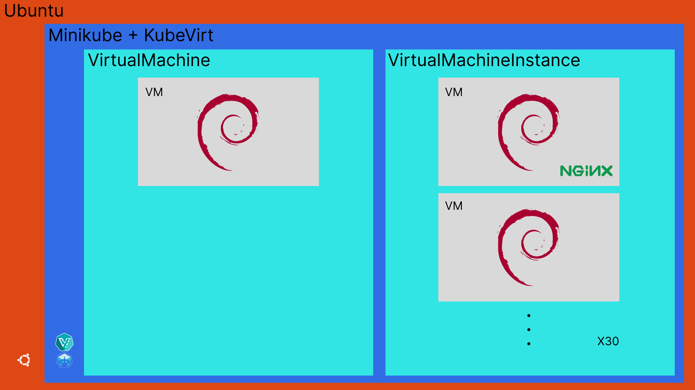
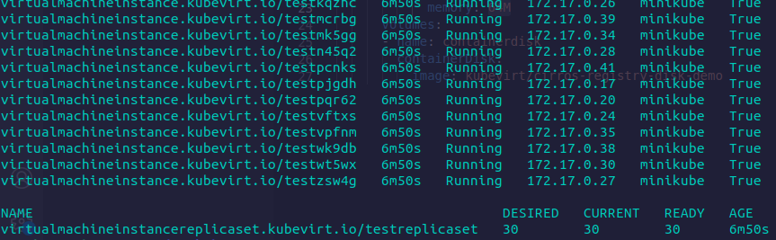

## 検証

---

## VM を⼤量に起動する

---

```yaml
apiVersion: kubevirt.io/v1alpha3
kind: VirtualMachineInstanceReplicaSet
metadata:
  name: testreplicaset
spec:
  replicas: 2
  selector:
    matchLabels:
      myvmi: myvmi
  template:
    metadata:
      name: test
      labels:
        myvmi: myvmi
    spec:
      domain:
        devices:
          disks:
            - disk:
              name: containerdisk
        resources:
          requests:
            memory: 64M
      volumes:
        - name: containerdisk
          containerDisk:
            image: kubevirt/cirros-registry-disk-demo
```

---

```yaml
spec:
  replicas: 2
```

```yaml
containerDisk:
  image: kubevirt/cirros-registry-disk-demo
```

---



---



---

k8s の機能は動くのか

---

k8s には<span style={{color: 'orange'}}>オートヒーリング</span>機能と言う Pod が停止すると<br />自動的に再起動してくれる機能がある、<br />その機能が KubeVirt にも機能するかを検証する

---

```bash
$ kubectl get all
NAME                                READY   STATUS    RESTARTS   AGE
pod/virt-launcher-test8z8fj-gg4gw   2/2     Running   0          2m3s
pod/virt-launcher-testxn22t-mpj7x   2/2     Running   0          48s

NAME                 TYPE        CLUSTER-IP   EXTERNAL-IP   PORT(S)   AGE
service/kubernetes   ClusterIP   10.96.0.1    <none>        443/TCP   10m

NAME                                           AGE    PHASE     IP            NODENAME   READY
virtualmachineinstance.kubevirt.io/test8z8fj   2m3s   Running   172.17.0.13   minikube   True
virtualmachineinstance.kubevirt.io/testxn22t   48s    Running   172.17.0.14   minikube   True

NAME                                                          DESIRED   CURRENT   READY   AGE
virtualmachineinstancereplicaset.kubevirt.io/testreplicaset   2         2         2       2m3s
```
